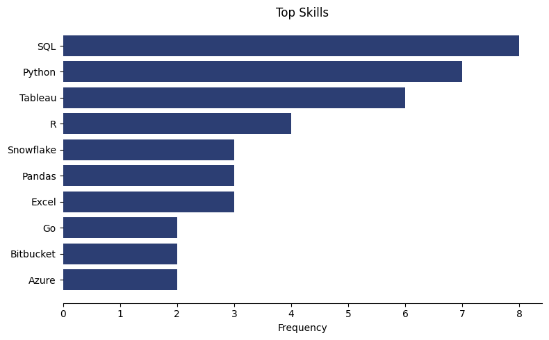

# Introduction

Diving into data analyst job market. 

This project explores in-demand skills, top-paying jobs where high salary and meet high demand.

SQL Queries Found here: [project_sql folder](/project_sql/)


# Background

### The questions answered through my SQL queries:

1. What are the top-paying data analyst jobs?
2. What are the skills required for these top-paying jobs?
3. What skills are most in demand for data analysts?
4. Which skills corresponds to higher salaries?
5. What are the most optimal or ideal skills to learn?

# Tools used

- **Visual Studio Code**: Connected PostgreSQL to VSCODE, here I run my queries.
- **SQL**: Query database and reveal critical insights.
- **PostgreSQL**: Chosen database management system for this project, connected to VSCode.
- **Git and GitHub**: Crucial for version control of SQL scripts. 

# Analysis

Queries used for each question:

### 1. Top Paying Data Analyst Jobs.

Identify the top paying remote Data Analyst jobs. 
```sql
SELECT 
    job_id,
    job_title,
    job_location,
    job_schedule_type,
    salary_year_avg,
    job_posted_date::DATE,
    name AS company_name
FROM job_postings_fact
LEFT JOIN company_dim ON job_postings_fact.company_id = company_dim.company_id
WHERE 
    salary_year_avg IS NOT NULL AND 
    job_title_short = 'Data Analyst' AND
    job_location = 'Anywhere'
ORDER BY salary_year_avg DESC
LIMIT 10;
```
**Insights**:
- **Diverse Employers:** Companies such as AT&Tdifferent companies like META, with interest across different industries. 
- **Salary Range:** 
High range of salary, ranging from 184K USD to 650k. This emphazies the signifiance of salary potential within Data Analytics.
- **Variety of Job Titles:**
High variety of data analyst roles, from Marketing Data Analyst to Director of Data Analyst.

### 2. Skills required for Top Paying Data Analyst Jobs.

```sql
With top_paying_jobs AS (
    SELECT 
    job_id,
    job_title,
    salary_year_avg,
    name AS company_name 
    FROM job_postings_fact
    LEFT JOIN company_dim ON job_postings_fact.company_id = company_dim.company_id
    WHERE 
        salary_year_avg IS NOT NULL AND 
        job_title_short = 'Data Analyst' AND
        job_location = 'Anywhere'
    ORDER BY salary_year_avg DESC
    LIMIT 10
)

SELECT 
    top_paying_jobs.*,
    skills
FROM top_paying_jobs
INNER JOIN skills_job_dim ON top_paying_jobs.job_id = skills_job_dim.job_id
INNER JOIN skills_dim ON skills_dim.skill_id = skills_job_dim.skill_id
ORDER BY
    salary_year_avg DESC


```



*2. Chart showing top 10 skills*

**Insights:** 

The top 10 skills among the highest payed data analyst jobs are SQL, followed by python Tableau and R. Suggesting database querying is important along with a programming language, data visualization program, cloud platforms and Excel. 


### 3. Demanded skills

```sql
SELECT
    skills,
    COUNT(skills_job_dim.job_id) AS demand_count
FROM job_postings_fact
INNER JOIN skills_job_dim ON job_postings_fact.job_id = skills_job_dim.job_id
INNER JOIN skills_dim ON skills_dim.skill_id = skills_job_dim.skill_id
WHERE 
    job_title_short = 'Data Analyst' AND 
    job_work_from_home = True
GROUP BY 
    skills
ORDER BY 
    demand_count DESC
LIMIT 5
```

| skills      | demand_count |
| ----------- | ----------- |
| SQL     | 7291|
| Excel   | 4611|
| Python  | 4330|
| Tableau | 3745|
| Power BI| 2609|

*3. Table showing top 5 skills*

**Insights:**

The most demanded skills (top 5) is SQL followd by Excel, python tableau and Power Bi. Suggesting that SQL is important, along with a spreadsheet program such as Excel and a BI tool such as Power BI. 


### 4. Top skills based on salary

```sql
SELECT
    skills,
    ROUND(AVG(salary_year_avg), 2) AS avg_salary
FROM job_postings_fact
INNER JOIN skills_job_dim ON job_postings_fact.job_id = skills_job_dim.job_id
INNER JOIN skills_dim ON skills_dim.skill_id = skills_job_dim.skill_id
WHERE 
    job_title_short = 'Data Analyst' 
    AND salary_year_avg IS NOT NULL
    AND job_work_from_home = True
GROUP BY 
    skills
ORDER BY 
    avg_salary DESC
LIMIT 25
```


| Skill           | Avg Salary |
|-----------------|-----------:|
| PySpark         | 208,172 |
| Bitbucket       | 189,154 |
| Couchbase       | 160,515 |
| Watson          | 160,515 |
| DataRobot       | 155,485 |
| GitLab          | 154,500 |
| Swift           | 153,750 |
| Jupyter         | 152,776 |
| Pandas          | 151,821 |
| Golang          | 145,000 |

*4. Table showing top 10 skills based on salary*

**Insights:**

Skills that correspond to higher salary with python libraries topping the list. Further reinforces the importance of learning a programming language such as python.


### 5. Optimal skills to learn
```sql
SELECT
    skills_dim.skill_id,
    skills_dim.skills,
    COUNT(skills_job_dim.job_id) AS demand_count,
    ROUND(AVG(salary_year_avg), 2) AS avg_salary
FROM
    job_postings_fact
INNER JOIN skills_job_dim ON job_postings_fact.job_id = skills_job_dim.job_id
INNER JOIN skills_dim ON skills_dim.skill_id = skills_job_dim.skill_id
WHERE 
        job_title_short = 'Data Analyst' AND 
        job_work_from_home = True AND 
        salary_year_avg IS NOT NULL
GROUP BY
    skills_dim.skill_id
HAVING
    COUNT(skills_job_dim.job_id)> 10
ORDER BY 
    avg_salary DESC,
    demand_count DESC
LIMIT 25;
```
| Rank | Skill      | Demand Count | Avg Salary (USD) |
| ---: | ---------- | ------------ | ---------------- |
|    1 | Go         | 27           | 115,319       |
|    2 | Confluence | 11           | 114,209       |
|    3 | Hadoop     | 22           | 113,192       |
|    4 | Snowflake  | 37           | 112,947       |
|    5 | Azure      | 34           | 111,225       |
|    6 | BigQuery   | 13           | 109,653       |
|    7 | AWS        | 32           | 108,317       |
|    8 | Java       | 17           | 106,906       |
|    9 | SSIS       | 12           | 106,683       |
|   10 | Jira       | 20           | 104,917       |

*5. Table showing most optimal skills by average salary*

**Insights:**

Based on both salary and demand, python along with Tableau and R tops the list. Useful to learn a programming language, SQL or visualization tool. Additionally learning a Cloud Platform such as AWS, Azure or GCP beneficial. SQL being one of the top demanded skills to learn.

# What I learned

- **Aggregating Data** Improved my SQL skills utilizing joins, aggregation functions, merging tables, creating and managing CTEs and subqueries. 

- **Provide Insights:** Cleaning and merging tables allowed me to gather useful insights.

# Conclusion

In conclusion, by utilizing and learning these SQL techniques I've been able to reveal useful insights and answers based on real world data.

- **1.** The top paying data analysts jobs shows a diverse range of job titles. With a wide salary range in different industries.

- **2.** The top 10 skills among the highest payed data analyst jobs are SQL, followed by python Tableau and R. Suggesting database querying is important along with a programming language, data visualization program, cloud platforms and Excel.

- **3.** The most demanded skills (top 5) is SQL followd by Excel, python tableau and Power Bi. Suggesting that SQL is important, along with a spreadsheet program such as Excel and a BI tool such as Power BI. 

- **4.**
Specific skills based on salary, python libraries topping the list which showcases the importance of increasing salary by learning a programming language like python.


- **5.**
Based on both salary and demand, python along with Tableau and R tops the list. Useful to learn a programming language, SQL or visualization tool. Additionally learning a Cloud Platform such as AWS, Azure or GCP beneficial. SQL being one of the top demanded skills to learn.


# Closing Thoughts
This project improved my SQL query skills, by cleaning, merging and structure data to provide insights in a real world scenario. With subqueries, CTEs, left and inner joins to combine tables and extrapolate insights. This project has improved my problem-solving and analytical skills.


